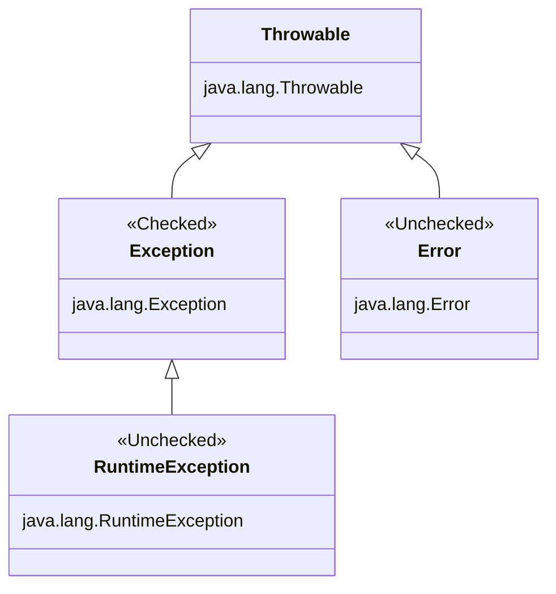

# Chapter 11: Exceptions and Localization

## OCP EXAM OBJECTIVES COVERED IN THIS CHAPTER:

### Handling Exceptions 

- Handle exceptions using try/catch/finally, try-with-resources, and multi-catch blocks, including custom exceptions.
  
### Implementing Localization 

- Implement localization using locales and resource bundles. 
- Parse and format messages, dates, times, and numbers, including currency and percentage values.

---

**Understanding Exceptions**

A program can fail for just about any reason. Here are just a few possibilities:

- The code tries to connect to a website, but the Internet connection is down.
- You made a coding mistake and tried to access an invalid index in an array.
- One method calls another with a value that the method doesn’t support.

**The Role of Exceptions**

An exception is Java’s way of saying “I give up. I don’t know what to do right now. You deal with it.” 

When you write a method, you can either deal with the exception or make it the calling code’s problem.

Deal or Delegate!

These are the two approaches Java uses when dealing with exceptions. A method can handle the exception case itself or make it the caller’s responsibility.

**Return Codes vs. Exceptions**

While common for certain tasks like searching, return codes with default or unexpected value should generally be avoided.

**Understanding Exception Types**

An exception is an event that alters program flow. Java has a `java.lang.Throwable` class for all objects that represent these events. 



**Checked Exceptions**

A checked exception is an exception that must be declared or handled by the application code where it is thrown. 

All checked exceptions inherit `java.lang.Exception` but not `java.lang.RuntimeException`.

Checked exceptions tend to be more anticipated. For example, trying to read a file that doesn’t exist. This might throw the following exception,

```java
java.io.FileNotFoundException extends java.io.IOException

java.io.IOException extends java.lang.Exception
```

Checked exceptions also include any class that inherits `java.lang.Throwable` but not `java.lang.Error` or `java.lang.RuntimeException`, such as a class that directly extends Throwable.

**Checked exceptions? What are we checking?**

Java has a rule called the handle or declare rule. The handle or declare rule means that all checked exceptions that could be thrown within a method are either wrapped in compatible try and catch blocks or declared in the method signature.

Because checked exceptions tend to be anticipated, Java enforces the rule that the programmer must do something to show that the exception was thought about.

**Unchecked Exceptions**

An unchecked exception is any exception that does not need to be declared or handled by the application code where it is thrown. 

Unchecked exceptions are often referred to as runtime exceptions, although in Java, unchecked exceptions include any class that inherits `java.lang.RuntimeException` or `java.lang.Error`.

It is permissible to handle or declare an unchecked exception. That said, it is better to document the unchecked exceptions callers should know about in a Javadoc comment rather than declaring an unchecked exception.

A runtime exception is defined as the `java.lang.RuntimeException` class and its subclasses. Runtime exceptions tend to be unexpected but not necessarily fatal. For example, accessing an invalid array index is unexpected. Even though they do inherit the Exception class, they are not checked exceptions.

An unchecked exception can occur on nearly any line of code, as it is not required to be handled or declared.

**Error and Throwable**

Error means something went so horribly wrong that your program should not attempt to recover from it. For example, the disk drive disappeared or the program ran out of memory.

While we can handle `java.lang.Throwable` and `java.lang.Error`. exceptions, it is not recommended.

**Exception Summary**

- **Unchecked exception**: subclass of `java.lang.RuntimeException`. It is okay to catch but not required to handle or declare.
- **Checked exception**: subclass of `java.lang.Exception` but not `java.lang.RuntimeException`. It is okay to catch, and must handle or declare.
- **Error**: subclass of `java.lang.Error`. They should not be caught, not required to handle or declare
- `java.lang.Throwable` is the parent of `java.lang.Exception` and `java.lang.Error` and should not be caught directly.

**Throwing an Exception**

Any Java code can throw an exception. Example,

```java
throw new Exception();
throw new Exception("Ow! I fell.");
throw new RuntimeException();
throw new RuntimeException("Ow! I fell.");
```

The `throw` keyword tells Java that you want some other part of the code to deal with the exception.

**`throw` vs `throws`**

The `throw` keyword tells Java that you want to throw an Exception, while the `throws` keyword simply declares that the method might throw an Exception. It also might not.

The `throw` keyword is used as a statement inside a code block to throw a new exception or rethrow an existing exception, while the `throws` keyword is used only at the end of a method declaration to indicate what exceptions it supports.

An Exception is an Object. This means we can store it in an object reference, and this is legal:

```java
var e = new RuntimeException();
throw e;
```

**Calling Methods That Throw Exceptions**

When you see a checked exception declared inside a catch block on the exam, make sure the code in the associated try block is capable of throwing the exception or a subclass of the exception.

**Overriding Methods with Exceptions**

An overridden method in a subclass is allowed to declare fewer exceptions than the superclass or interface. 

An overridden method not declaring one of the exceptions thrown by the parent method is similar to the method declaring that it throws an exception it never actually throws. T

Similarly, a class is allowed to declare a subclass of an exception type. The idea is the same. The superclass or interface has already taken care of a broader type.