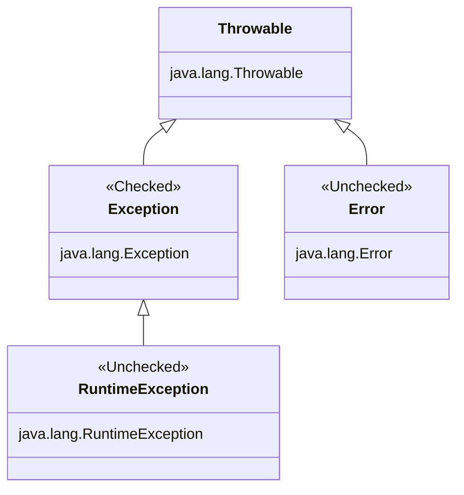

# Chapter 11: Exceptions and Localization

## OCP EXAM OBJECTIVES COVERED IN THIS CHAPTER:

### Handling Exceptions 

- Handle exceptions using try/catch/finally, try-with-resources, and multi-catch blocks, including custom exceptions.
  
### Implementing Localization 

- Implement localization using locales and resource bundles. 
- Parse and format messages, dates, times, and numbers, including currency and percentage values.

---

**Understanding Exceptions**

A program can fail for just about any reason. Here are just a few possibilities:

- The code tries to connect to a website, but the Internet connection is down.
- You made a coding mistake and tried to access an invalid index in an array.
- One method calls another with a value that the method doesn’t support.

**The Role of Exceptions**

An exception is Java’s way of saying “I give up. I don’t know what to do right now. You deal with it.” 

When you write a method, you can either deal with the exception or make it the calling code’s problem.

Deal or Delegate!

These are the two approaches Java uses when dealing with exceptions. A method can handle the exception case itself or make it the caller’s responsibility.

**Return Codes vs. Exceptions**

While common for certain tasks like searching, return codes with default or unexpected value should generally be avoided.

**Understanding Exception Types**

An exception is an event that alters program flow. Java has a `java.lang.Throwable` class for all objects that represent these events. 



**Checked Exceptions**

A checked exception is an exception that must be declared or handled by the application code where it is thrown. 

All checked exceptions inherit `java.lang.Exception` but not `java.lang.RuntimeException`.

Checked exceptions tend to be more anticipated. For example, trying to read a file that doesn’t exist. This might throw the following exception,

```java
java.io.FileNotFoundException extends java.io.IOException

java.io.IOException extends java.lang.Exception
```

Checked exceptions also include any class that inherits `java.lang.Throwable` but not `java.lang.Error` or `java.lang.RuntimeException`, such as a class that directly extends Throwable.

**Checked exceptions? What are we checking?**

Java has a rule called the handle or declare rule. The handle or declare rule means that all checked exceptions that could be thrown within a method are either wrapped in compatible try and catch blocks or declared in the method signature.

Because checked exceptions tend to be anticipated, Java enforces the rule that the programmer must do something to show that the exception was thought about.

**Unchecked Exceptions**

An unchecked exception is any exception that does not need to be declared or handled by the application code where it is thrown. 

Unchecked exceptions are often referred to as runtime exceptions, although in Java, unchecked exceptions include any class that inherits `java.lang.RuntimeException` or `java.lang.Error`.

It is permissible to handle or declare an unchecked exception. That said, it is better to document the unchecked exceptions callers should know about in a Javadoc comment rather than declaring an unchecked exception.

A runtime exception is defined as the `java.lang.RuntimeException` class and its subclasses. Runtime exceptions tend to be unexpected but not necessarily fatal. For example, accessing an invalid array index is unexpected. Even though they do inherit the Exception class, they are not checked exceptions.

An unchecked exception can occur on nearly any line of code, as it is not required to be handled or declared.

**Error and Throwable**

Error means something went so horribly wrong that your program should not attempt to recover from it. For example, the disk drive disappeared or the program ran out of memory.

While we can handle `java.lang.Throwable` and `java.lang.Error`. exceptions, it is not recommended.

**Exception Summary**

- **Unchecked exception**: subclass of `java.lang.RuntimeException`. It is okay to catch but not required to handle or declare.
- **Checked exception**: subclass of `java.lang.Exception` but not `java.lang.RuntimeException`. It is okay to catch, and must handle or declare.
- **Error**: subclass of `java.lang.Error`. They should not be caught, not required to handle or declare
- `java.lang.Throwable` is the parent of `java.lang.Exception` and `java.lang.Error` and should not be caught directly.

**Throwing an Exception**

Any Java code can throw an exception. Example,

```java
throw new Exception();
throw new Exception("Ow! I fell.");
throw new RuntimeException();
throw new RuntimeException("Ow! I fell.");
```

The `throw` keyword tells Java that you want some other part of the code to deal with the exception.

**`throw` vs `throws`**

The `throw` keyword tells Java that you want to throw an Exception, while the `throws` keyword simply declares that the method might throw an Exception. It also might not.

The `throw` keyword is used as a statement inside a code block to throw a new exception or rethrow an existing exception, while the `throws` keyword is used only at the end of a method declaration to indicate what exceptions it supports.

An Exception is an Object. This means we can store it in an object reference, and this is legal:

```java
var e = new RuntimeException();
throw e;
```

**Calling Methods That Throw Exceptions**

When you see a checked exception declared inside a catch block on the exam, make sure the code in the associated try block is capable of throwing the exception or a subclass of the exception.

**Overriding Methods with Exceptions**

An overridden method in a subclass is allowed to declare fewer exceptions (or none at all) than the superclass or interface. 

An overridden method not declaring one of the exceptions thrown by the parent method is similar to the method declaring that it throws an exception it never actually throws. T

Similarly, a class is allowed to declare a subclass of an exception type. The idea is the same. The superclass or interface has already taken care of a broader type.

The overridden method can throw fewer or narrower exceptions, but the compiler only looks at the declared type, not the actual object. The compile-time type of the reference determines what exceptions you must handle.

**Recognizing Exception Classes**

**RuntimeException Classes**

Common unchecked exceptions (`RuntimeException` subclasses):

- `ArithmeticException`: thrown when dividing by zero.
- `ArrayIndexOutOfBoundsException`: thrown when accessing an array with an invalid index.
- `ClassCastException`: thrown when an object is cast to an incompatible class.
- `NullPointerException`: thrown when code tries to use `null` where an object is required.
- `IllegalArgumentException`: thrown by the programmer to indicate an invalid or inappropriate argument.
- `NumberFormatException`: subclass of `IllegalArgumentException`; thrown when converting a `String` to a number fails due to improper format.

These are unchecked exceptions, so the compiler does not require the programmer to catch or declare them.

**`NullPointerException`**

For `NullPointerException`, the JVM will tell the names of the instance and static variable in nice, easy-to-read format. It is called *Helpful `NulPointerEx eption`* and thus JVM tells the programmer the object reference that triggered the `NullPointerException`. Example,

```java
Exception in thread "main" java.lang.NullPointerException:
   Cannot invoke "String.toLowerCase()" because "Frog.name" is null
````

On local variables (including method parameters), it is not as friendly, unless the `-g:vars` argument is passesd while compilation. Example,

```java
Exception in thread "main" java.lang.NullPointerException:   
    Cannot invoke "String.toLowerCase()" because "<parameter1>" is null
````

But, if the `-g:vars` argument is passesd while compilation, then the exception is helpful. Example,

```java
javac -g:vars Frog.java
java Frog

Exception in thread "main" java.lang.NullPointerException:
   Cannot invoke "String.toLowerCase()" because "name" is null
```

`NumberFormatException` is a subclass of `IllegalArgumentException` which is very much relavant to the exam (the relationship between them).


**Checked Exception Classes**


Checked exceptions extend `Exception` but not `RuntimeException`. Checked exceptions must be handled or declared. `FileNotFoundException` and `NotSerializableException` extend `IOException`. Common Checked Exceptions:

- `IOException`: error while reading or writing data
- `FileNotFoundException`: file not found (subclass of `IOException`)
- `NotSerializableException`: object not serializable (subclass of `IOException`)
- `ParseException`: input data cannot be parsed


**Error Classes**

Errors extend `Error` and are *unchecked*. They are thrown by the JVM and should not be handled or declared. Programs usually cannot recover from errors, and on the exam you just need to recognize them as serious JVM problems. Common Errors:

- `ExceptionInInitializerError`: thrown when a static initializer fails
- `StackOverflowError`: thrown due to deep or infinite recursion
- `NoClassDefFoundError`: class was present at compile time but missing at runtime
- `OutOfMemoryError`: JVM runs out of heap memory while allocating objects


**Handling Exceptions**

1. Using `try` and `catch` Statements
2. Automating Resource Management (try-with-resources)

**Using `try` and `catch` Statements**

A `try` block must be followed by at least one `catch` or a `finally` block. A `try` block alone is invalid and will not compile.

**Chaining catch Blocks**

If multiple execptions are chained together, that are in inheritance relationship, more specific (subclass) exception should be caught first. The order matters. For example,

```java
// NumberFormatException should be caught first
NumberFormatException extends IllegalArgumentException

// FileNotFoundException should be caught first
FileNotFoundException extends IOException
```

At most one catch block will run, and it will be the first catch block that can handle the exception. 

**Applying a Multi-catch Block**

If we want the result of an exception that is thrown to be the same, regardless of which particular exception is thrown, we can use a multi-catch block.
A multi-catch block allows multiple exception types to be caught by the same catch block.

Java intends multi-catch to be used for exceptions that aren’t related, and it prevents you from specifying redundant types in a multi-catch. 

Specifying related exceptions in the multi-catch is redundant.

The one difference between multi-catch blocks and chaining catch blocks is that order does not matter for a multi-catch block within a single catch expression.

**Adding a `finally` Block**

The `finally` block always executes, whether or not an exception occurs.
The `catch` block is optional when `finally` is used.

There are two paths through code with both a catch and a finally. 

1. If an exception is thrown, the `finally` block is run after the `catch` block. 
2. If no exception is thrown, the `finally` block is run after the `try` block completes.

If a `try` statement with a `finally` block is entered, then the `finally` block will always be executed, regardless of whether the code completes successfully.

**`System.exit()`**

There is one exception to “the finally block will always be executed” rule: Java defines a method that you call as `System.exit()`. It takes an integer parameter that represents the status code that is returned.

```java
try {   
    System.exit(0);
} finally {   
    System.out.print("Never going to get here");  // Not printed
}
```

**2. Automating Resource Management**

**Resource Leak**

Applications often interact with external resources such as files and databases by opening a connection or stream, performing read/write operations, and then closing the resource. If a resource is not properly closed, it can lead to a resource leak. This happens when connections remain open, eventually exhausting available resources.

For example, failing to close database connections may prevent other parts of the application—or even other applications—from accessing the database. While memory leaks are commonly discussed, resource leaks can be just as harmful, making critical systems inaccessible. In exam contexts, resources usually refer to files or databases that require streams or connections, which must always be closed after use.

**Introducing Try-with-Resources**

*try-with-resources* statement automatically closes all resources opened in a try clause. This feature is also known as automatic resource management, because Java automatically takes care of the closing. Example,

```java
try (FileInputStream is = new FileInputStream("file.txt")) {
    // Read the file
} catch (IOException e) {
    e.printStackTrace();
}
```

By using a try-with-resources statement, we guarantee that as soon as a connection passes out of scope, Java will attempt to close it within the same method. 

Behind the scenes, the compiler replaces a try-with-resources block with a try and finally block. We refer to this “hidden” finally block as an implicit finally block since it is created and used by the compiler automatically.

You can still create a programmer-defined finally block when using a try-with-resources statement; just be aware that the implicit one will be called first.

**Notes**

Unlike garbage collection, resources are not automatically closed when they go out of scope.

Therefore, it is recommended that you close resources in the same block of code that opens them. By using a try-with-resources statement to open all your resources, this happens automatically.

**Basics of Try-with-Resources**

One or more resources can be opened in the try clause. When multiple resources are opened, they are closed in the reverse of the order in which they were created. 

Parentheses are used to list those resources, and semicolons are used to separate the declarations. This works just like declaring multiple indexes in a for loop. Example,

```java
try (var in = new FileInputStream("input.txt"); var out = = new FileOutputStream("output.txt");) {
    // Protected Code
} catch (IOException e) {
    // Exception handler
} finally {
    // finally block
}
```

With *try-with-resources* the `catch` and `finally` blocks are optional.

For the exam, it is required to know that the implicit finally block runs before any programmer-coded ones.

**Constructing Try-with-Resources Statements**

Only classes that implement the `AutoCloseable` interface can be used in a try-with-resources statement. 

Inheriting `AutoCloseable` requires implementing a compatible `close()` method.

```java
interface AutoCloseable {   
    public void close() throws Exception;
}
```

Resources that implement `Closeable` rather than `AutoCloseable` also support *try-with-resources* statement since `Closeable` interface extends `AutoCloseable` interface. The only difference between the two is that `close()` method of `Closeable` interface declares `IOException`, while `close()` method `AutoCloseable` interface declares `Exception`.

**Declaring Resources**

We can declare a resource using `var` as the data type in a *try-with-resources* statement, since resources are local variables within the scope. Example,

```java
try (var f = new BufferedInputStream(new FileInputStream("it.txt"))) {   
    // Process file
}
```

**Scope of Try-with-Resources**

The resources created in the try clause are in scope only within the try block.

The implicit finally runs before any explicit catch/finally blocks and the implicit `close()` has run already, and the resource is no longer available.

In a traditional try statement, the variable has to be declared before the try statement so that both the try and finally blocks can access it, which has the unpleasant side effect of making the variable in scope for the rest of the method, just inviting the programmer to call it by accident.

**Following Order of Operations**

When working with *try-with-resources* statements, it is important to know that resources are closed in the reverse of the order in which they are created. 

For the exam, remember, the resources are closed in the reverse of the order in which they are declared, and the implicit finally is executed before the programmer-defined finally.

**Applying Effectively Final**

While resources are often created in the *try-with-resources* statement, it is possible to declare them ahead of time, provided they are marked final or are effectively final.

*Remember, the test for <u>effectively final</u> is that if we insert the final keyword when the variable is declared, the code still compiles.*

If a variable is not an effectively final variable, it cannot be used in a try-with-resources.

**Understanding Suppressed Exceptions**

In a try-with-resources statement, Java automatically calls `close()` after the try block finishes.

But If:

- The try block throws an exception, and
- The `close()` method also throws an exception

Then:

- The exception from the try block becomes the primary exception.
- The exception from `close()` becomes a suppressed exception.
- Suppressed exceptions are attached to the primary exception and can be retrieved using `getSuppressed()`.
- Catch blocks match only the primary exception, not suppressed ones.


```java
class CloseableResource implements AutoCloseable {

    @Override
    public void close() {
        throw new IllegalStateException("Problem while closing resource");
    }
}

void main(String[] args) {
    try (CloseableResource r = new CloseableResource()) {
        System.out.println("Using closeable resource");
        throw new RuntimeException("Prblem while executing try-with-resources");
    } catch (IllegalStateException e) {
        System.out.println("Exception for resource closing (uncaught, suppressed)");
    } catch (Exception e) {
        System.out.println("Main exception: " + e.getMessage());
        e.forEach((Throwable t) -> System.out.println("Suppressed: " + t.getMessage()));
    }
}

// Output:
// Primary: Problem inside try block
// Suppressed: Problem while closing resource
```

**Key Rules**

If both the try block and `close()` throw exceptions:

- The try block exception wins.
- The `close()` exception is suppressed.
- Only the primary exception determines which catch block runs.


**1. Suppressed Exceptions Are Stored Automatically**

Java remembers the suppressed exceptions that go with a primary exception even if we don’t handle them in the code.

Even if you do not call `getSuppressed()`, Java still attaches suppressed exceptions to the primary exception internally. They are preserved unless something else replaces the primary exception.

**2. Multiple Resources**

If multiple resources throw exceptions:

- Resources are closed in reverse order of declaration.
- The first exception thrown during closing becomes the primary exception.
- Any additional exceptions are suppressed.
- Because of reverse closing order, the primary exception will come from the last declared resource that throws.

Example concept:

```java
try (A a = new A(); B b = new B()) {
    // no exception here
}
```

Closing order:

1. `b.close()`
2. `a.close()`

If both throw exceptions:

- Exception from `b.close()` becomes primary.
- Exception from `a.close()` becomes suppressed.

**3. Suppressed Exceptions Do NOT Apply to finally**

Suppressed exceptions only apply to exceptions thrown in the try-with-resources process (try block + automatic close).

If a finally block throws an exception, it replaces everything before it.

Example:

```java
try (CloseableResource r = new CloseableResource()) {
    throw new IllegalStateException("Error in try");
} finally {
    throw new RuntimeException("Error in finally");
}
```

What happens:

1. Try throws `IllegalStateException`.
2. Resource is closed (may add suppressed exception).
3. Finally throws `RuntimeException`.
4. The finally exception replaces all previous exceptions.

Final result:
Only the RuntimeException is visible.
Previous exceptions are lost.

**Exam Notes**

- Suppressed exceptions occur when `close()` throws after a try exception.
- Only the primary exception determines which catch block runs.
- Resources close in reverse order.
- Finally exceptions override and discard previous exceptions.
- Throwing exceptions from finally is bad practice because it hides earlier failures.

**Formatting Values**

Java provides APIs to format numbers, dates, and times for user display. For the exam, focus on `NumberFormat`, `DecimalFormat`, and `DateTimeFormatter`, including custom patterns and symbol compatibility.

**Formatting Numbers**

`NumberFormat` is an abstract class used to format numeric values. It provides:

- `format(double)`
- `format(long)`

```java
abstract class NumberFormat {
    public final String format(double number)
    public final String format(long number)
}

class DecimalFormat extends NumberFormat {}
class CompactNumberFormat extends NumberFormat {}
```

`DecimalFormat` is a concrete subclass used with pattern strings:

```java
double d = 1234.567;

NumberFormat f1 = new DecimalFormat("###,###,###.0");
System.out.println(f1.format(d));   // 1,234.6

NumberFormat f2 = new DecimalFormat("000,000,000.00000");
System.out.println(f2.format(d));   // 000,001,234.56700

NumberFormat f3 = new DecimalFormat("Your Balance $#,###,###.##");
System.out.println(f3.format(d));   // Your Balance $1,234.57
```

Important pattern symbols:

- `#` optional digit, omitted if not present
- `0` mandatory digit, displays 0 if not present
- `,` grouping separator
- `.` decimal separator
- Literal text may be included directly

`#` removes unused positions.
`0` forces leading or trailing zeros.
Rounding occurs if fewer decimal places are specified.

You should also know that `CompactNumberFormat` is another subclass of `NumberFormat`.

**Formatting Dates and Times**

Date and time objects provide accessor methods:

```java
LocalDate date = LocalDate.of(2025, Month.OCTOBER, 20);

date.getDayOfWeek();   // MONDAY
date.getMonth();       // OCTOBER
date.getYear();        // 2025
date.getDayOfYear();   // 293
```

**Using Standard Formatters**

`DateTimeFormatter` provides predefined formats:

```java
LocalDate date = LocalDate.of(2025, Month.OCTOBER, 20);
LocalTime time = LocalTime.of(11, 12, 34);
LocalDateTime dt = LocalDateTime.of(date, time);

System.out.println(date.format(DateTimeFormatter.ISO_LOCAL_DATE));      // 2025-10-20
System.out.println(time.format(DateTimeFormatter.ISO_LOCAL_TIME));      // 11:12:34
System.out.println(dt.format(DateTimeFormatter.ISO_LOCAL_DATE_TIME));   // 2025-10-20T11:12:34
```

Formatting with an incompatible type causes a runtime exception:

```java
date.format(DateTimeFormatter.ISO_LOCAL_TIME);   // DateTimeException
time.format(DateTimeFormatter.ISO_LOCAL_DATE);   // DateTimeException
```

**Custom Date/Time Formats**

Custom patterns are created using:

```java
DateTimeFormatter.ofPattern("pattern")
```

Example:

```java
var dt = LocalDateTime.of(2025, Month.OCTOBER, 20, 6, 15, 30);
var formatter = DateTimeFormatter.ofPattern("MM/dd/yyyy hh:mm:ss");

System.out.println(dt.format(formatter));   // 10/20/2025 06:15:30
```

Common pattern symbols:

- `y` year
- `M` month
- `d` day
- `H` 24-hour format
- `h` 12-hour format
- `m` minute
- `s` second
- `a` AM or PM
- `z` time zone name
- `Z` time zone offset

Case matters:

- `M` is month, `m` is minute
- `H` is 24-hour, `h` is 12-hour

Number of letters changes formatting:

- `M` minimal digits
- `MM` two digits
- `MMM` short name
- `MMMM` full name

Example:

```java
var dt = LocalDateTime.of(2025, Month.OCTOBER, 20, 6, 15, 30);

System.out.println(dt.format(DateTimeFormatter.ofPattern("MM_yyyy_-_dd"))); // 10_2025_-_20
System.out.println(dt.format(DateTimeFormatter.ofPattern("hh:mm:z")));      // DateTimeException (no zone)
```

`LocalDateTime` does not contain time zone data. Use `ZonedDateTime` when formatting with `z` or `Z`.

**Symbol Compatibility by Type**

You must match pattern symbols with the correct date/time type:

- `LocalDate` supports year, month, day
- `LocalTime` supports hour, minute, second
- `LocalDateTime` supports both date and time fields
- `ZonedDateTime` supports date, time, and zone symbols

Using unsupported symbols results in a runtime exception.

**Two Ways to Format**

Both of the following are valid and equivalent:

```java
var dt = LocalDateTime.of(2025, Month.OCTOBER, 20, 6, 15, 30);
var formatter = DateTimeFormatter.ofPattern("MM/dd/yyyy hh:mm:ss");

System.out.println(dt.format(formatter));        // 10/20/2025 06:15:30
System.out.println(formatter.format(dt));        // 10/20/2025 06:15:30
```

**Adding Custom Text**

Unescaped letters are interpreted as pattern symbols. To include literal text, use single quotes.

Correct usage:

```java
var dt = LocalDateTime.of(2025, Month.OCTOBER, 20, 6, 15, 30);
var f = DateTimeFormatter.ofPattern("MMMM dd, yyyy 'at' hh:mm");

System.out.println(dt.format(f));   // October 20, 2025 at 06:15
```

To include a single quote in output, use two single quotes:

```java
var g = DateTimeFormatter.ofPattern("MMMM dd', Party''s at' hh:mm");

System.out.println(dt.format(g));   // October 20, Party's at 06:15
```

Invalid patterns throw `IllegalArgumentException`:

```java
DateTimeFormatter.ofPattern("The time is hh:mm");   // IllegalArgumentException
DateTimeFormatter.ofPattern("'Time is: hh:mm: ");   // IllegalArgumentException (unterminated quote)
```

**Exam Notes**

- `DecimalFormat` uses `#` and `0` for digit control.
- `DateTimeFormatter` is type-sensitive; mismatched symbols cause runtime exceptions.
- Case matters in date/time patterns.
- Use single quotes to escape literal text.
- Incomplete or invalid pattern symbols cause runtime exceptions.
- `ZonedDateTime` is required for time zone formatting.
